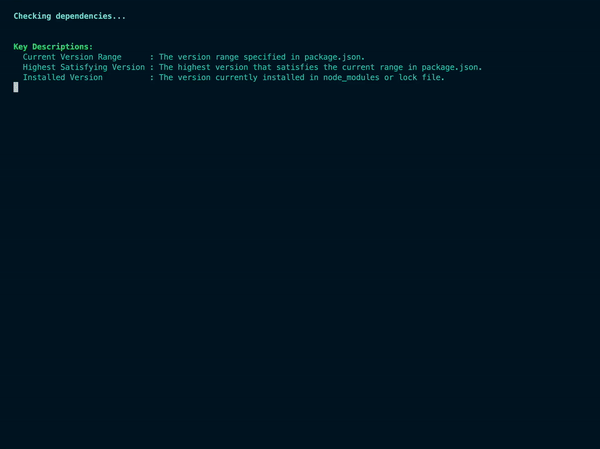

# Dependency Checker CLI

**Dependency Checker CLI** is a powerful command-line tool that analyzes the dependencies in your `package.json` file. It checks for the latest versions available on npm, determines upgrade requirements, and provides insights into your project’s dependencies.



## Features

- Analyze dependencies from `package.json` (including nested dependencies in `overrides`).
- Check for updates and classify them as major, minor, or patch.
- Identify whether a dependency will self-upgrade based on semantic versioning rules.
- Supports complex version ranges like `>=1.0.0 <3.0.0`.
- Provides a clear and concise output for easy readability.
- Compatible with `package-lock.json` and `yarn.lock`.

## Installation

Install globally using npm:

```bash
npm install -g dependency-checker-cli
```

Or, clone the repository and link the tool:

```bash
git clone https://github.com/moumen-soliman/dependency-checker-cli.git
cd dependency-checker-cli
npm install
npm link
```

## Usage

### Analyze All Dependencies

To analyze all dependencies in your project:

```bash
dependency-checker-cli
```

### Check a Specific Dependency

To check a specific dependency:

```bash
dependency-checker-cli --check <package-name>
```

For example:

```bash
dependency-checker-cli --check semver
```

### Example Output

```plaintext
Checking dependencies...

Key Descriptions:
  Current Version Range      : The version range specified in package.json.
  Highest Satisfying Version : The highest version that satisfies the current range in package.json.
  Installed Version          : The version currently installed in node_modules or lock file.
  Latest Version             : The most recent version available on npm.
  Published Date             : The publication date of the latest version.
  Upgrade Need Type          : The type of update required (major, minor, patch, or none).
  Will Self-Upgrade          : Indicates if the package will self-upgrade based on the highest satisfying version.

semver
  Current Version Range      : ^7.6.3
  Highest Satisfying Version : 7.6.3
  Installed Version          : 7.6.3
  Latest Version             : 7.6.3
  Published Date             : 2024-07-17
  Upgrade Need Type          : none
  Will Self-Upgrade          : No
------------------------------------------------------------

Dependency check completed.
```

### Key Descriptions
- **Current Version Range**: The range specified in `package.json`.
- **Highest Satisfying Version**: The highest version satisfying the current range.
- **Installed Version**: The version currently installed locally.
- **Latest Version**: The latest version available on npm.
- **Published Date**: The publication date of the latest version.
- **Upgrade Need Type**: The type of upgrade required (`major`, `minor`, `patch`, or `none`).
- **Will Self-Upgrade**: Whether the dependency will self-upgrade within its current range.

## Supported Files

- `package.json`
- `package-lock.json`
- `yarn.lock`

## Contributing

Contributions are welcome! Please submit issues or pull requests to the [GitHub repository](https://github.com/moumen-soliman/dependency-checker-cli).

## Development

To run the tool locally:

1. Clone the repository:

   ```bash
   git clone https://github.com/moumen-soliman/dependency-checker-cli.git
   cd dependency-checker-cli
   ```

2. Install dependencies:

   ```bash
   npm install
   ```

3. Run the CLI:

   ```bash
   node index.js
   ```

## License

This project is licensed under the [MIT License](https://opensource.org/licenses/MIT).

## Issues and Bugs

For issues and feature requests, please visit the [GitHub Issues Page](https://github.com/moumen-soliman/dependency-checker-cli/issues).
